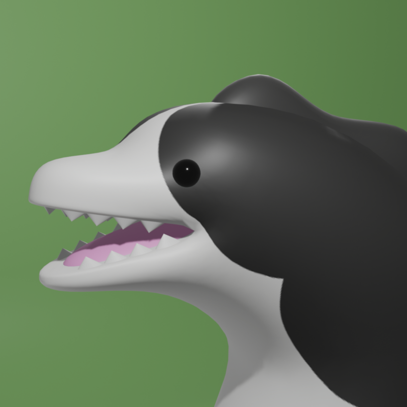
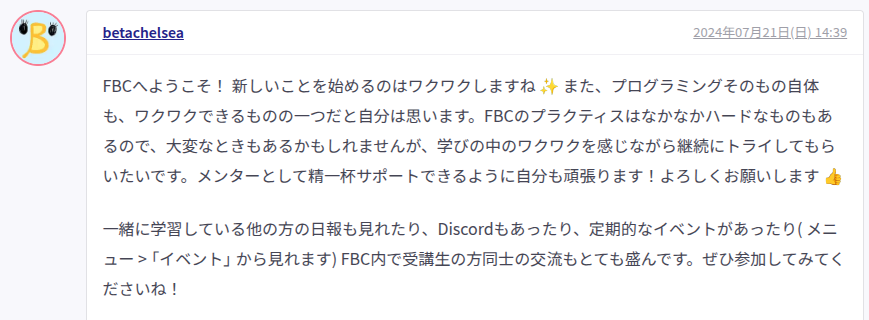
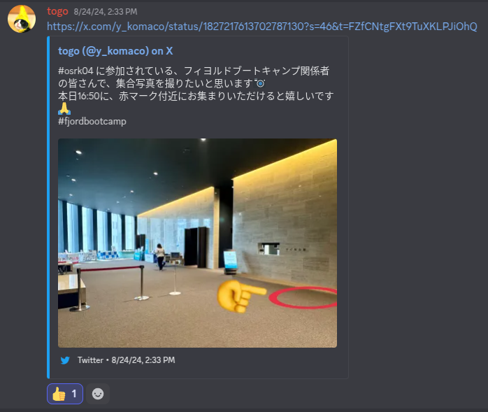
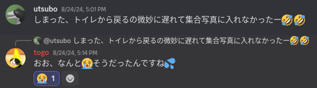

# FBCでできたつながり

###### 人見知りだけど、工夫したらつながりができた話し

utsubo(@utsubo1024)

2025/06/14

⚡️初めてのLT会 Vol.16

---

## 自己紹介

---

## 名前: utsubo

「うつぼ」って呼んでください

---

---

## 趣味: ジョジョ、旅行、

## うなぎを食べること

車での東北一周旅行が一番の思い出です。
おすすめのうなぎ屋があれば教えて下さい。

---

## FBCに入った理由(つかみ)

---

## 「日報を書く」プラクティス

---

## 初めて日報を書く

---

## メンターのべーたさんから返信

---

---

## 輪読会面白そう！

---

## いくつかの輪読会に参加

---

## 輪読会で相談

---

## 「日報にスタンプ押しても大丈夫ですかね...」

---

## 「全然大丈夫ですよ！」

---

## 見た日報全てにスタンプを付ける日々の始まり

---

## 大阪Ruby会議04に参加

---

## 初のカンファレンス参加🎉

---

## セッションを聞くの楽しい！

---

---

## 初めて他のFBC生と会う機会

---

## 集合場所に行くと...

---

## いない...???

---

---

## 結局最後まで会えず😭

---

## カンファレンス自体はすごく楽しかった😃

---

## 別のFBCミートアップにて

## 気づいてもらう方法を教えてもらった

---

## 名札にシールを貼る

---

名札にシール貼った写真

---

## NFCタグを作る

---

NFCタグ写真

---

## エクスチェンジLT会 :

## FBC学習での工夫と

## 取り組み

(去年の10月に開催)

---

## 「アイコン見知り」

## という言葉を知る

  引用: sugiweさんの発表「機会を作り、できることを楽しむ」(https://speakerdeck.com/sugiwe/enjoy-what-you-can-do)

---

## 分報にもスタンプを

## 付ける日々の始まり

---

## フィヨブーフェス

---

## Kaigi on Rails参加

---

## 輪読会共同主催のお誘い

---

## ビブリオバトルに登壇

---

## 仲間が増える

---

## RubyKaigi参加

---

## 同じ技術好きの仲間ができる

---

## 人見知りは克服できず

---

## ただ、仲間はできた

---

## 出来ないことより

## 出来ることをやってみた

---

## 出来ること

---

## 興味があるイベントに参加

---

## 技術イベント

---

## キーボード仲間

---

## 好きな言葉

## (アフリカの諺)

---

## 早く行きたければ

## 一人で進め

## 遠くまで行きたければ

## 皆で進め

---

## 卒業まで一緒に

## 進みましょう🙌
