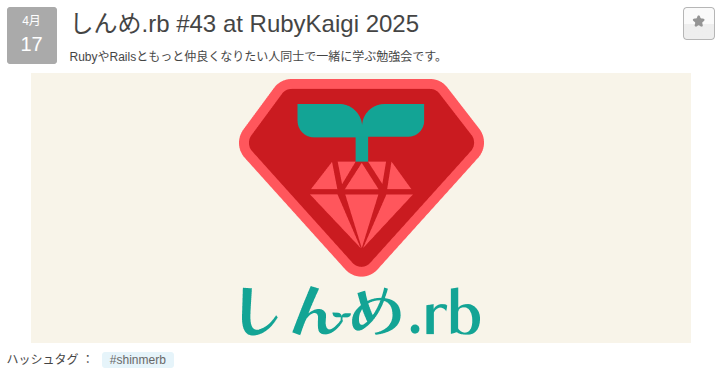
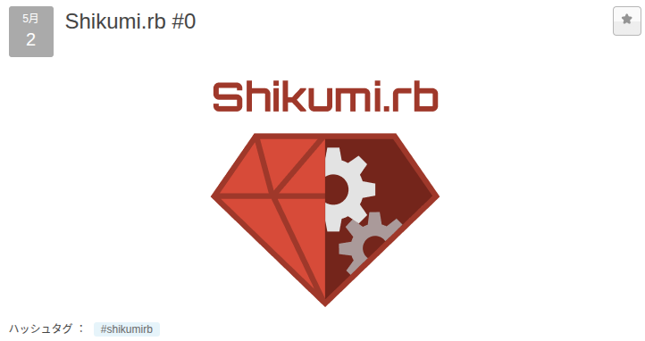

# 人見知りの自分が

# コミュニティを作るまで

utsubo(@utsubo1024)

2025/06/14

⚡️初めてのLT会 Vol.16

---

## 自己紹介

---

## 名前: utsubo

「うつぼ」って呼んでください

---

---

## 趣味: ジョジョ、旅行、

## うなぎを食べること

車での東北一周旅行が一番の思い出です。
おすすめのうなぎ屋があれば教えて下さい。

---

## 性格: ワクワク駆動タイプ

---

## 面白そうなことが好き😃

---

## たくさんの面白いことに

## 出会った

---

## でも

---

## 最初からではない

---

## 最初は小さな

## 「つながり」から

---

## 1.

---

## 日報・分報でのつながり

---

## 日報あるある

---

## 時間かかりがち😇

---

## WIPたまりがち😇

---

## 感情・学習内容の

## 言語化難しいから

---

## 皆の日報・分報を参考🧐

---

## 学習以外の内容も

## 書かれていて面白い😃

---

## だんだんスタンプで

## リアクションするように🙌

---

## 「アイコン見知り」

## ができた🙌

  引用: sugiweさんのLT発表「機会を作り、できることを楽しむ」(https://speakerdeck.com/sugiwe/enjoy-what-you-can-do)

---

## ゆるいつながりが

## たくさんできた🤝

---

## 2.

---

## 輪読会でのつながり

---

## 輪読会あるある

---

## 初参加怯えがち😇

(自分のレベルでついていけるのかな...)
(話されてる内容、全然分からないかも...)

---

## 参加方法分からなくて

## 迷い子になりがち😇

(どこ...どこ...)

---

## きっかけは日報

---

---

## 定期的なイベント...?🤔

---

---

## 面白そう👀👀

---

## いくつかの輪読会に参加！

---

## どの輪読会でも

## 皆さん優しい🥺

---

## 分厚い本でも

## 難しい本でも

---

## 一緒だと読める

---

## プラクティスの悩みも相談

---

## 雑談も楽しい

---

## だんだんFBCに

## 馴染んできた

---

## 3.

---

## イベントでのつながり

---

## 外部イベントあるある

---

## 初参加怯えがち😇

(何も知らないけど大丈夫かな...?)
(一人でも参加してもいいのかな...?)
(イベント会場どこ...どこ...)

---

## アイコンしか知らないから

## リアルの顔わからなくて

## 挨拶できなくなりがち😇

---

## 初めて参加した

## 外部イベント

---

---

## 初参加のきっかけ

---

---

## これは行かなあかん！！！

---

## 開催1週間前に

## チケット購入🎫

---

## 勢い大事！

---

## あまり理解できなかった

## けど楽しかった

---

## イベントに参加する内に

## 顔を覚えてもらって

---

## そこから徐々に

## つながりが広がった

---

## RubyKaigi2025事前勉強会

---

---

## 言語処理、面白そう！

---

## RubyKaigi Day1

---

## フィヨブーハウスで

## 言語処理の勉強

---

## RubyKaigi Day2

## しんめ.rbランチ会

---

---

## フィヨブーハウスでの

## 言語処理の勉強について

## 熱弁していると

---

## 言語処理に興味を持つ

## 仲間ができた🥳

---

## RubyKaigi終了後

---

## Shikumi.rb立ち上げ🎉

---

---

## 立ち上げの際にも

## 皆さんに助けていただいた

---

## 自分から話しかけることは

## 苦手だけど

---

## ワクワク駆動で

## 行動していたら

---

## つながりがいつの間にか

## 大きくなっていた

---

## 皆さんに本当に感謝🙏

---

## 好きな言葉

## (アフリカの諺)

---

## 早く行きたければ

## 一人で進め

## 遠くまで行きたければ

## 皆で進め

---

## 卒業まで一緒に

## 進みましょう🙌

---

## どこかで見かけたら

## 話しかけてきて下さい🙏
