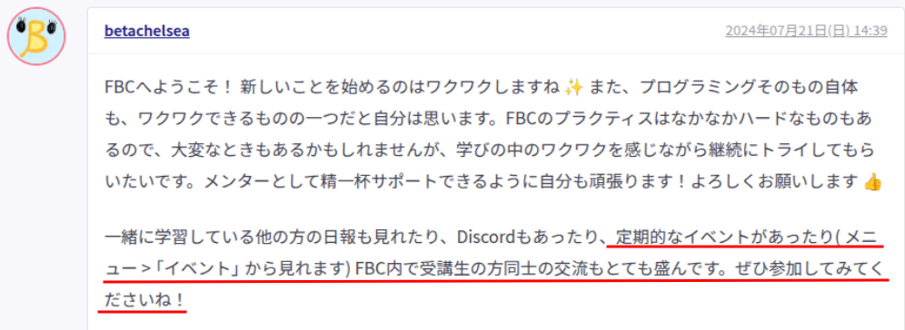

# 人見知りの自分が

# コミュニティを作るまで

utsubo(@utsubo1024)

2025/06/14

⚡️初めてのLT会 Vol.16

---

## 自己紹介

---

## 名前: utsubo

「うつぼ」って呼んでください

---

---

## 趣味: ジョジョ、旅行、

## うなぎを食べること

車での東北一周旅行が一番の思い出です。
おすすめのうなぎ屋があれば教えて下さい。

---

## 性格: ワクワク駆動タイプ

---

## 面白そうなことが好き😃

---

## たくさんの面白いことに

## 出会った

---

## でも

---

## 最初からではない

---

## 最初は小さな

## 「つながり」から

---

## 1.

---

## 日報・分報でのつながり

---

## 日報・分報あるある

---

## 時間かかりがち😇

---

## WIPたまりがち😇

---

## 感情・学習内容の

## 言語化難しいから

---

## 皆の日報・分報を参考🧐

---

## 学習以外の内容も

## 書かれていて面白い😃

---

## だんだんスタンプで

## リアクションするように🙌

---

## 「アイコン見知り」

## ができた🙌

  引用: sugiweさんのLT発表「機会を作り、できることを楽しむ」(https://speakerdeck.com/sugiwe/enjoy-what-you-can-do)

---

## ゆるいつながりが

## たくさんできた🤝

---

## 2.

---

## 輪読会でのつながり

---

## 輪読会あるある

---

## 初参加怯えがち😇

(自分のレベルでついていけるのかな...)
(話されてる内容、全然分からないかも...)

---

## 参加方法分からなくて

## 迷い子になりがち😇

(どこ...どこ...)

---

## きっかけは日報

---

メモ: 定期的なイベント以下に赤下線追加
輪読会

---

## 定期的なイベント...?🤔

---

---

## 面白そう👀👀

---

## いくつかの輪読会に参加！

---

## どの輪読会でも

## 皆さん優しい🥺

---

## 分厚い本でも

## 難しい本でも

---

## 一緒だと読める

---

## プラクティスの悩みも相談

---

## 雑談も楽しい

---

## だんだんFBCに

## 馴染んできた

---

## 3.

---

## イベントでのつながり

---

## 外部イベントあるある

---

## 初参加怯えがち😇

(何も知らないけど大丈夫かな...?)
(一人でも参加してもいいのかな...?)
(イベント会場どこ...どこ...)

---

## アイコンしか知らないから

## リアルの顔わからなくて

## 挨拶できなくなりがち😇

---

## 初めて参加した

## 外部イベント

---

## 大阪Ruby会議04

---

## 初参加のきっかけ

---

---

## これは行かなあかん！！！

---

## 開催1週間前に

## チケット購入🎫

---

## 勢い大事！

---

## あまり理解できなかった

## けど楽しかった

---

## 初めて他のFBC生と会う機会

---

---

## 集合場所に行くと...

---

## いない...???

---

---

## 結局最後まで会えず😭

---

## カンファレンス自体はすごく楽しかった😃

---

## FBCミートアップにて

## 気づいてもらう方法を

## 教えてもらった

---

## 名札にシールを貼る

---

名札にシール貼った写真

---

## NFCタグを作る

---

NFCタグ写真

---

## 次こそは...🔥🔥

---

## フィヨブーフェス

---

## Kaigi on Rails参加

---

## 輪読会共同主催のお誘い

---

## ビブリオバトルに登壇

---

## 仲間が増える

---

## RubyKaigi参加

---

## 同じ技術好きの仲間ができる

---

## 人見知りは克服できず

---

## ただ、仲間はできた

---

## 出来ないことより

## 出来ることをやってみた

---

## 出来ること

---

## 興味があるイベントに参加

---

## 技術イベント

---

## キーボード仲間

---

## 好きな言葉

## (アフリカの諺)

---

## 早く行きたければ

## 一人で進め

## 遠くまで行きたければ

## 皆で進め

---

## 卒業まで一緒に

## 進みましょう🙌

---

## どこかで見かけたら

## 話しかけてきて下さい🙏
