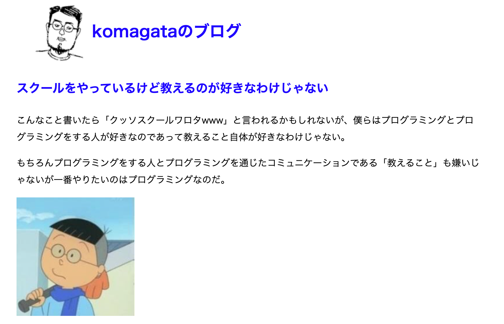

# Shikumi.rb のしくみ

hashimoto-kei, utsubo

2025/09/06

定期イベントEXPO 2025

---

## 自己紹介

---

## 名前: utsubo

「うつぼ」って呼んでください

---

---

## 最近ハマっていること: Hollow Knight: Silksong

---

## 名前: hashimoto-kei

---

---

## 趣味：サウナ、Podcast

---

## 1. 読んでいる本

---

---

## 2. きっかけ

---

## RubyKaigi

---

## フィヨブーハウス

---

## しんめ.rbのランチ会

---

## 3. 雰囲気

---

  引用: https://docs.komagata.org/5588

---

## デモ

---

## 4. 対象者

---

## ちょっとでも面白い

## と思った人！

---

## 5. 参加方法

---

## connpassから参加

---

---

---

## 6. 開催日時

---

## 隔週金曜日

## 20:00 ~ 21:30

---

## 7. 最後に

---

## おーい、磯野

## Shikumi.rbやろうぜ！
