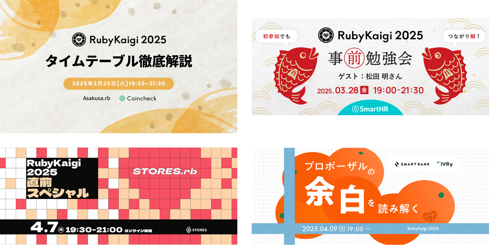
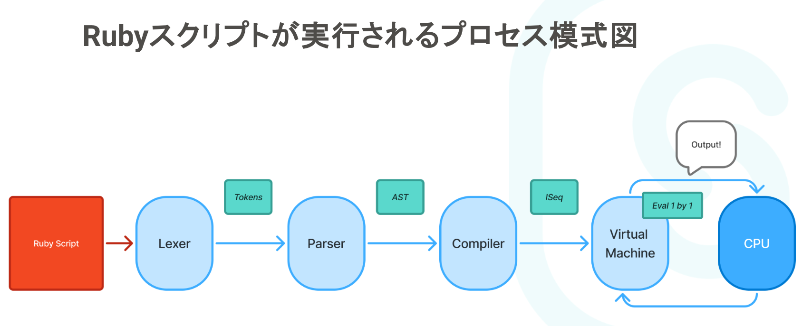
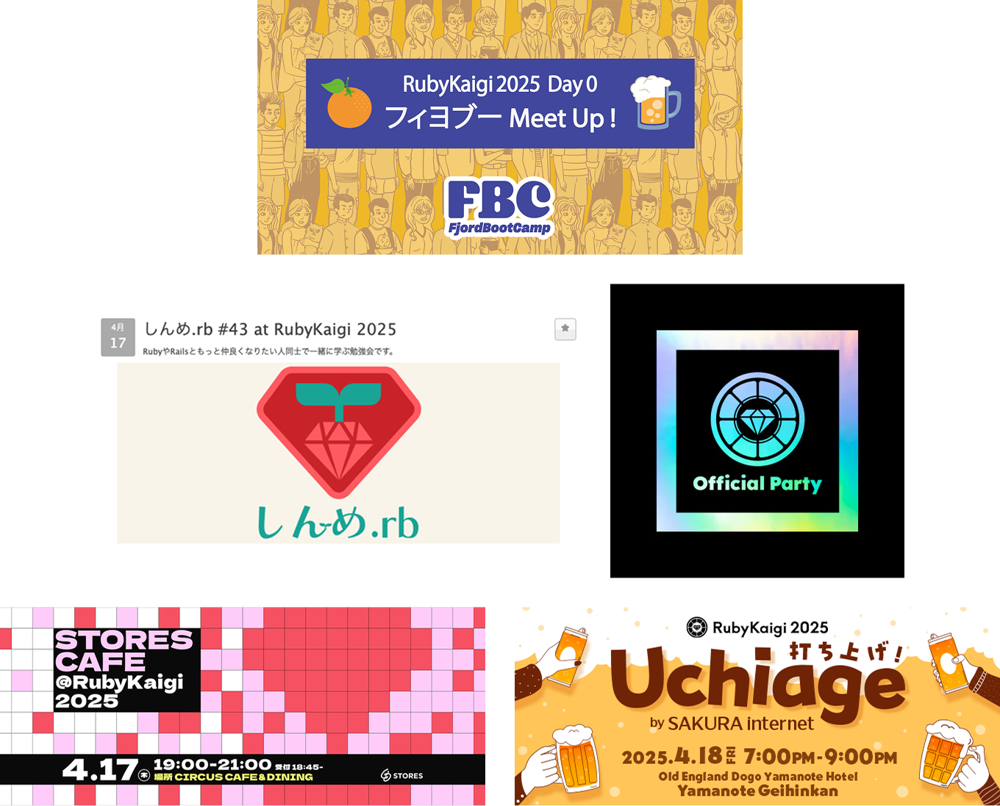
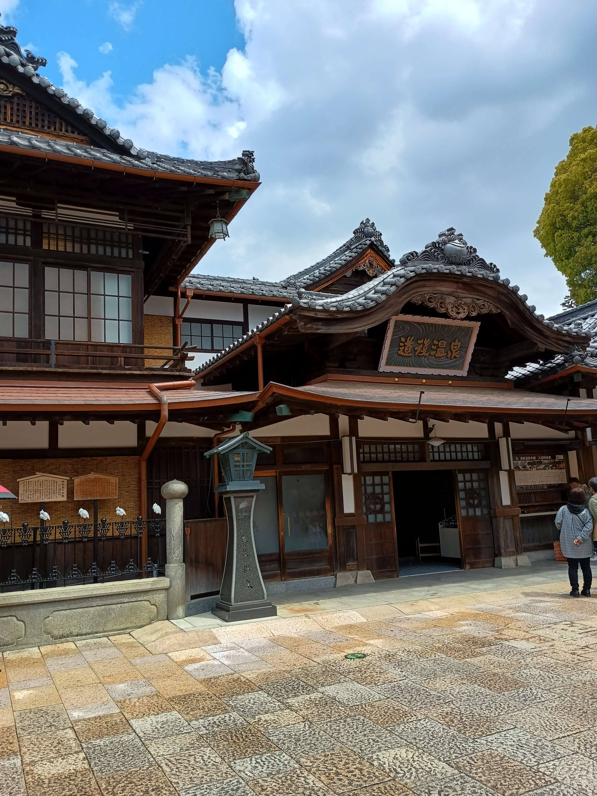
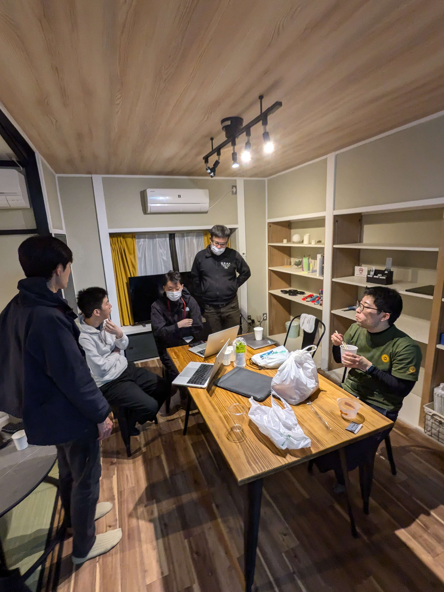
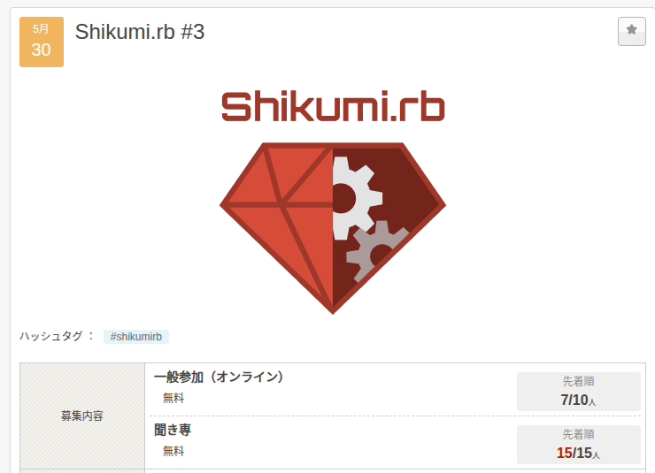
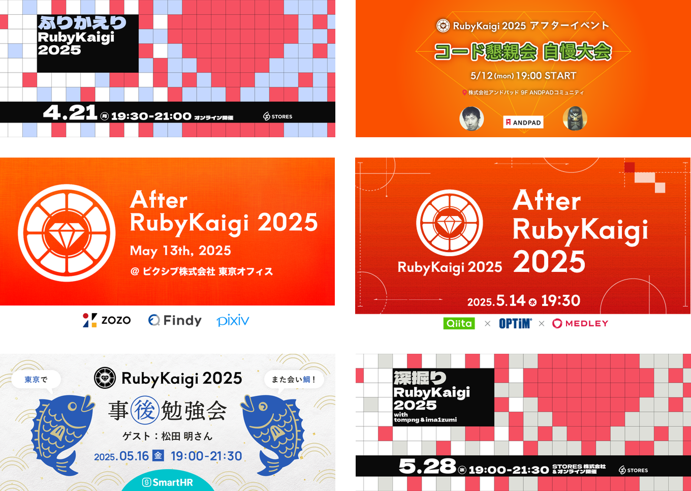

# RubyKaigi 2025振り返り

###### 最大限楽しむためにやったこと/Kaigi Effect

utsubo(@utsubo1024)

2025/05/29

🍊RubyKaigi 2025 スペシャル

---

## 自己紹介

---

## 名前: utsubo

「うつぼ」って呼んでください

---

---

## 趣味: ジョジョ、

## キーボード、水族館巡り

ジョジョは7部が特に好きです
キーボードはCorne V4 Cherryを使ってます

---

## RubyKaigi初参加🎉

---

## 半年くらい前からワクワク

---

## 最大限楽しみたい！

---

## RubyKaigi関連イベント

## 合計15個に参加🥳

---

## まずはRubyKaigi開催前に

---

## 事前イベント4つに参加

---

---

## どういうジャンルが

## 話されるか知った

---

  引用: Rubyの中身の予備知識-RubyKaigiの前に知り鯛！(https://docs.google.com/presentation/d/1oFvP4W3Ox8uiGXsWa3ibyDga1cpLguVZhwCjpD46hFU/mobilepresent?slide=id.g112e5bc9415_0_27)

---

## 気になる分野を見つけた！

---

## 準備万端！

---

## Day0

---

## 愛媛へ出発✈️

---

## RubyKaigi中

## 5つのイベントに参加

---

---

## 初対面のFBC生と話したり

---

## ベテランRubyistから

## Rubyの歴史を学んだり

---

## Rubyist達と交流

---

## つながりができた🙌

---

## どのイベントも最高🍻

---

## フィヨブーハウスに宿泊

---

## ほぼ毎日道後温泉へ♨️

---

---

## 3回目くらいからは

## 近所の銭湯の感覚

---

## Day1の夜

---

## AM2:00まで

---

---

## 言語処理って楽しい！

## ワイワイ😃

---

## Day2 朝

---

## めっちゃ寝不足...🫩

---

## Day2 昼

---

## maimuさん主催の

## ランチ会に参加

---

## 言語処理の話しになり

---

## コミュニティ立ち上げの

## 機運...

---

## Day2の夜

---

## さすがに疲れたので

## 早めに就寝

---

## のはずだった

---

## AM2:00

---

---

## 言語処理って楽しい！

## ワイワイ😃

---

## Day3 朝

---

## Why...?🫩🫩🫩

---

## フィヨブーハウスに泊まり

---

## リアルでワイワイできる

## 仲間ができた

---

## 最高の思い出✨

---

## Day4

---

## 道後温泉、松山城に行き

## お土産を買って

---

## 東京に到着✈️

---

## 数日後...

---

## Shikumi.rb立ち上げ

---

---

## よくよく考えると

---

## 事前勉強会に参加

## → 言語処理に興味が湧く

---

## フィヨブーハウス

## → 仲間ができる

---

## Shinme.rbランチ会

## → コミュニティ機運

---

## すべてFBC関連...！！！

---

## 圧倒的感謝ッ！！！

---

## RubyKaigi 2025

## 最高でした！！！

---

## 来年のRubyKaigiを

## もっと楽しみたい🔥🔥

---

## RubyKaigi後

## 6つのイベントに参加

---

---

## コード懇親会面白そう👀

---

## 他の人のRubyKaigiの

## 楽しみ方が参考になった

---

## 来年までの目標

---

## 言語処理の基礎を理解

---

## RubyKaigi 2026も

## 楽しむぞー🔥🔥
